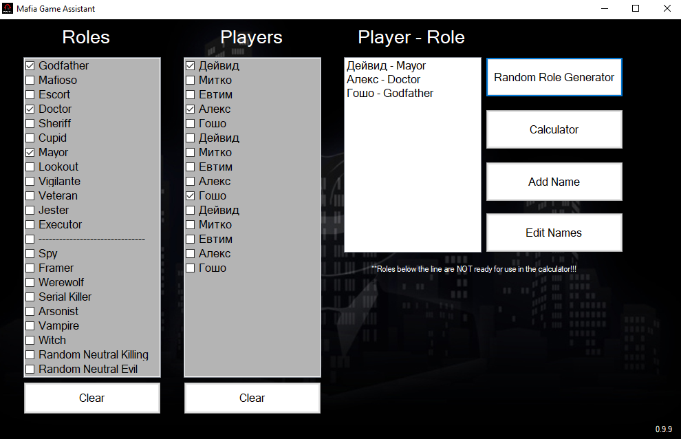
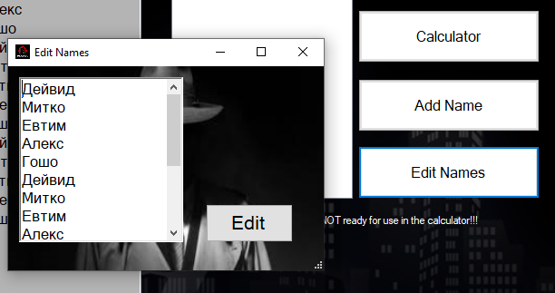
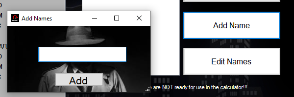
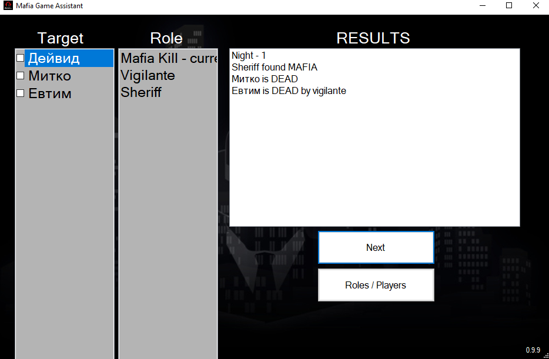

# Mafia Game Assistant

The projects aims to create an assistant for the popular game of Mafia. It currently includes 19 roles. For 12 of them the assistant auto calculates the results from the night.

## The Game
Mafia, also known as Werewolf, is a social deduction game, created by Dimitry Davidoff in 1986. The game models a conflict between two groups: an informed minority (the mafiosi or the werewolves), and an uninformed majority (the villagers). At the start of the game, each player is secretly assigned a role affiliated with one of these teams. The game has two alternating phases: first, a night role, during which those with night killing powers may covertly kill other players, and second, a day role, in which surviving players debate the identities of players and vote to eliminate a suspect. The game continues until a faction achieves its win condition; for the village, this usually means eliminating the evil minority, while for the minority this usually means reaching numerical parity with the village and eliminating any rival evil groups.

### Night

All players close their eyes. The moderator then instructs all werewolves to open their eyes and acknowledge their accomplices. The werewolves pick a "victim" by silently gesturing to indicate their target and to show unanimity then close their eyes again.

A similar process occurs for other roles with nightly actions. In the case of the seer, the moderator may indicate the target's innocence or guilt by using gestures such as nodding or head shaking.
Night may be accompanied by players tapping gently to mask sounds made by gesturing. When everyone closes their eyes at night, it is best for people to also start humming, tapping the table, patting a knee, or making some noise. This will cover up any sounds made accidentally by the werewolves, the seer, or the moderator.

### Day
The moderator instructs players to open their eyes and announces who "died" the previous night. Discussion ensues among the living players. At any point, a player may accuse someone of being a werewolf and prompt others to vote to eliminate them. If over half of the players do so, the accused person is eliminated and night begins. Otherwise, the phase continues until an elimination occurs.

According to some rules, the role of dead players should not be revealed; according to others, for example, if the protector dies, nobody should know that. In both cases, dead players are not permitted to attempt to influence the remainder of the game.

Because players have more freedom to deliberate, days tend to be longer than nights.

## My project
##### The project is created in VS using C#. It features a random generator, giving each selected player a role. 

##### The user can add any name of a player he wants or edit the current list.
### Editing the whole list:

### Adding names:

##### The project also has an automated night calculator for 12 of the available roles. The user must select a target for each of the roles in order. After that the result of the night is displayed on screen.

